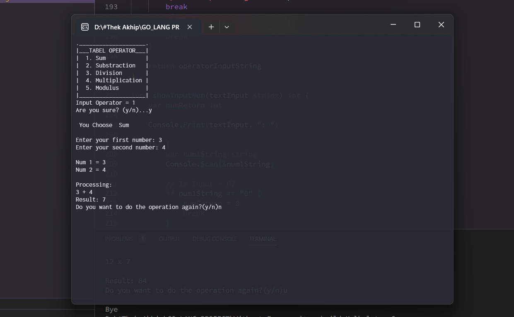

# Kalkulator-Go_Lang


## Hello👋

Language: English

## Description:
  A simple calculator tool is used to calculate addition, Subtraction, Multiplication, division, and modulus.

### Overview


## Instruction : 
- Clone this repo ( ```git clone https://github.com/Khip01/Kalkulator-Go_Lang.git``` )  **|| Or ||** Download this repo
- Run the file with the .exe extension

## Code Editor :
- Visual Studio Code
  - Extension: Go
 
# Use
[](https://github.com/Khip01)
